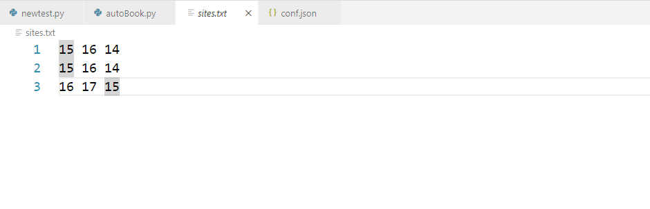
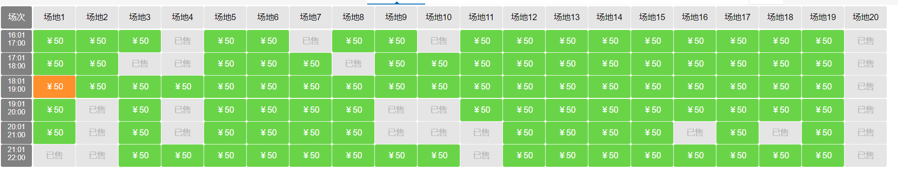

## 不要传播，小心被拷打
- 可以提前运行在电脑上
- 需要手动支付(后续再加)

### 环境安装

```bash
pip install -r requirements.txt
```

### config.json 配置

```json
{
    "user": "******",
    "pwd": "******",
    "login_url": "http://ydfwpt.cug.edu.cn/login/pre.html?continueurl=http://ydfwpt.cug.edu.cn/product/show.html?id=1",
    "target_url": "http://ydfwpt.cug.edu.cn/index.html"
}

```

在user和pwd处配置自己的账户和密码

其余的不用动

### 配置site.txt



参数说明:

- 为了保证能够抢到心仪的场，可以在txt文件中配置，每一行表示一次预约，如果当前行已经被抢走，那么就会依次抢接下来的场，优先级可以人为配置

- eg: 15 16 表示时间段，15.01-16.00/16.01-17.00，第三个数字表示第几号场，如下图

  



- 不用担心时间段问题，代码中已经处理过边界问题


### 配置完环境之后，一键启动即可

### 后续工作
- 直接支付完毕，无需手工支付
